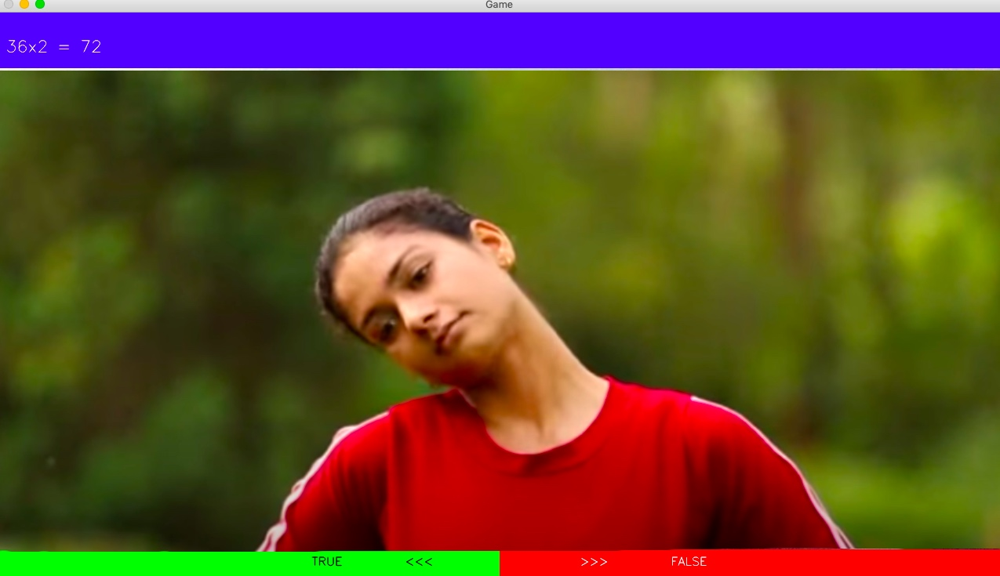
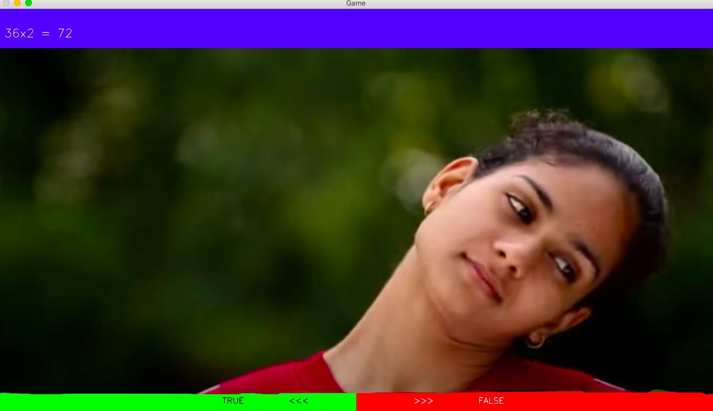
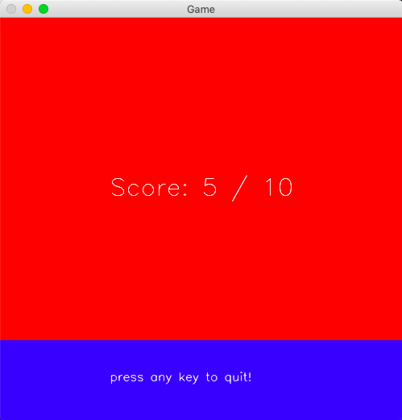

# Project Details

## "True or False" Game 

### Answer questions by rotating your head in Z axis and collect points!

#### You can edit app-data/config/data.json for organizing questions.

#
<p float="left">
  
   
</p>

<p float="left">
  
</p>

## Installation

Use the package manager [pip](https://pip.pypa.io/en/stable/) to install requirements.

```bash
python3 -m venv test-env #create test-env (optional)

source test-env/bin/activate #activate test-env (optional)

pip3 install -r requirements.txt #install required packages

```

## Usage

```
python3 main.py --source local # read questions from local json file

#or

python3 main.py --source trivia # download questions from trivia api
```

## Contributing
Pull requests are welcome. For major changes, please open an issue first to discuss what you would like to change.

## License
[MIT](https://choosealicense.com/licenses/mit/)


### Tested with following environments

macOS Mojave 10.14.5 & python 3.6
